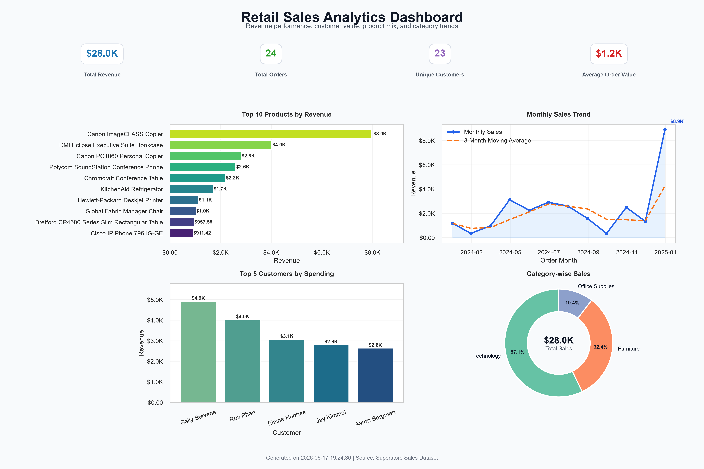

# Retail Sales Analytics Dashboard

An end-to-end Python analytics project that cleans a Superstore retail sales CSV, calculates business KPIs, and generates a polished dashboard image for a Data Analyst portfolio.

## Project Overview

Retail teams need a clear view of revenue performance, product demand, customer value, and category mix. This project turns raw transaction data into executive-ready insights by combining repeatable data cleaning, KPI analysis, and a professional dashboard built with Python.

The dashboard answers practical business questions:

- Which products generate the most revenue?
- How are sales trending month over month?
- Who are the highest-value customers?
- Which categories contribute the largest share of sales?

## Dataset

This project is designed for the Kaggle Superstore Sales Dataset. Place the CSV at:

```text
data/superstore.csv
```

A small Superstore-shaped sample CSV is included so the project runs immediately. For a GitHub portfolio version, replace it with the full Kaggle dataset export before generating final insights.

## Technologies

- Python
- Pandas
- NumPy
- Matplotlib
- Seaborn

## Project Structure

```text
retail-sales-analytics-dashboard/
|
├── data/
│   └── superstore.csv
|
├── output/
│   ├── dashboard.png
│   ├── cleaned_data.csv
│   └── summary_report.txt
|
├── retail_dashboard.py
├── requirements.txt
├── README.md
└── .gitignore
```

## Dashboard Preview



## Key Insights

- Top products reveal the revenue drivers that deserve inventory focus, margin review, and promotional planning.
- Customer behavior analysis highlights the highest-value customers for retention and account development.
- Monthly sales trends show revenue momentum and smooth volatility with a three-month moving average.
- Category performance identifies which parts of the assortment contribute most to total sales.

The script also writes a concise business summary to `output/summary_report.txt`.

## How to Run

Install dependencies:

```bash
pip install -r requirements.txt
```

Generate the cleaned data, dashboard image, and summary report:

```bash
python retail_dashboard.py
```

Expected terminal message:

```text
Dashboard Successfully Generated
Location: output/dashboard.png
```

## Outputs

- `output/dashboard.png`: Portfolio-ready dashboard image at 300 DPI.
- `output/cleaned_data.csv`: Cleaned CSV after duplicate removal, type conversion, and missing-value treatment.
- `output/summary_report.txt`: Executive summary with total revenue, top product, top customer, best category, order count, and date range.

## Code Quality

The project uses modular functions, logging, exception handling, detailed cleaning comments, and PEP8-friendly formatting so the repository reads like a production analytics deliverable rather than a one-off notebook.
